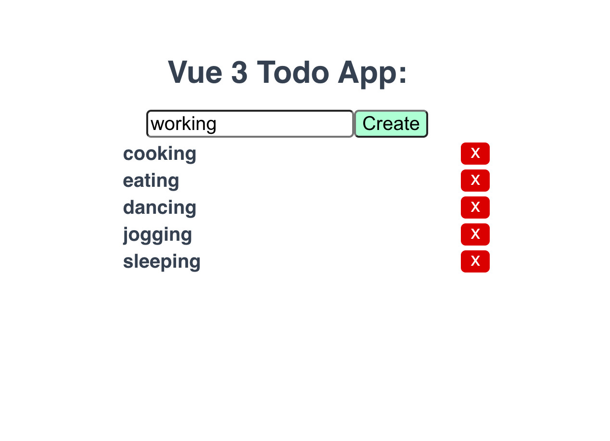

# vue3-todo



Description: 
https://medium.com/javascript-in-plain-english/build-a-simple-todo-app-with-vue-3-de6b9251e1d

## Project setup
```
yarn install
```

### Compiles and hot-reloads for development
```
yarn serve
```

### Compiles and minifies for production
```
yarn build
```

### Lints and fixes files
```
yarn lint
```

### Customize configuration
See [Configuration Reference](https://cli.vuejs.org/config/).
